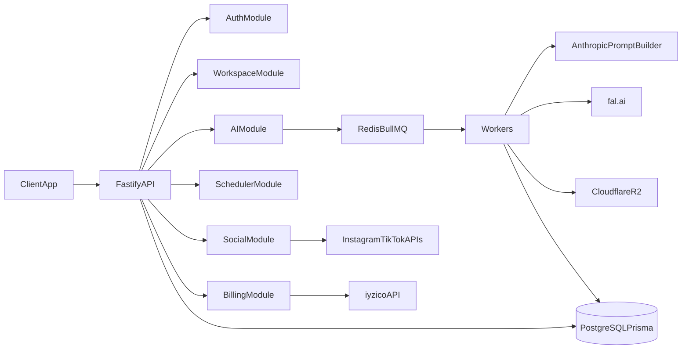
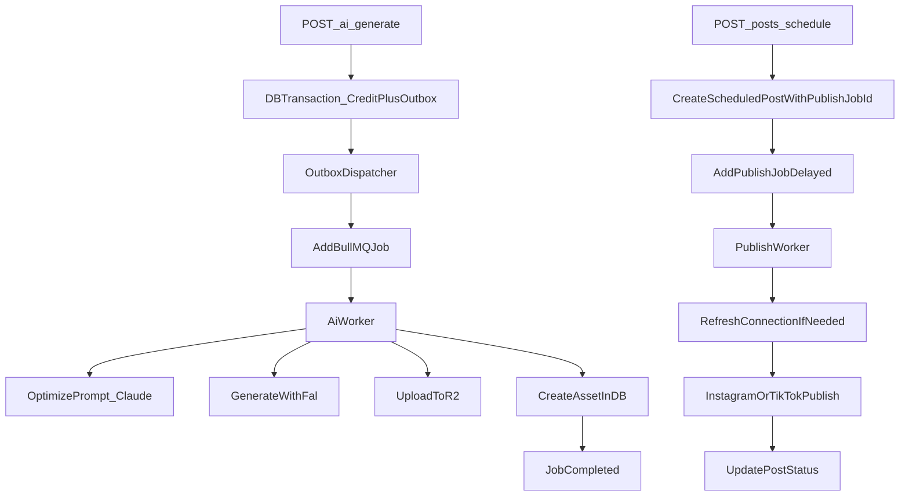

# Socialcraft AI Backend API Documentation

## Overview

This backend is a Fastify + TypeScript + Prisma modular monolith for:

- authentication and workspace management
- AI asset generation (image/video) with queued workers
- social account connection (Instagram/TikTok OAuth)
- scheduled publishing
- credit billing

## Tech Stack

- Runtime: Node.js, TypeScript
- HTTP: Fastify
- Validation: Zod
- ORM: Prisma (PostgreSQL)
- Queue: BullMQ (Redis)
- Storage: Cloudflare R2 (S3-compatible)
- AI: fal.ai (generation), Anthropic (prompt optimization)
- Payments: iyzico

## Base URL

- Local default: `http://localhost:3001`

## Global Response Format

Most routes return:

- success: `{ "success": true, "data": ... }`
- error: `{ "success": false, "message": "..." }`

Note: auth middleware currently returns `{ success: false, error: 'Unauthorized' }` (uses `error` key instead of `message`).

## Authentication

Protected routes require:

- `Authorization: Bearer <access_token>`

Access token is returned by:

- `POST /auth/register`
- `POST /auth/login`
- `POST /auth/refresh`
- `GET /auth/google/callback` (when configured)

Refresh token flow:

- client sends refresh token to `POST /auth/refresh`
- API returns new access token + rotated refresh token

## High-Level Architecture

## Endpoints

### Health

#### GET `/health`
- Auth: No
- Description: checks DB and queue connectivity
- Success: `200` when DB and queue are healthy
- Degraded: `503` when one of them fails

Response `data`:

- `status`: `ok | degraded`
- `db`: `connected | error`
- `queue`: `working | error`
- `timestamp`

---

### Auth

#### GET `/auth/google`
- Auth: No
- Description: starts Google OAuth redirect
- Returns:
  - `302` redirect to Google when configured
  - `503` when Google OAuth env vars are not configured

#### GET `/auth/google/callback`
- Auth: No
- Query:
  - `code` (required when successful callback)
  - `state` (required, signed JWT)
  - `error`, `error_description` (Google error callback)
- Returns:
  - `200` with `{ token, refreshToken, user }` on success
  - `400/403/500` on validation/provider/internal errors
  - `503` when Google OAuth env vars are not configured

#### POST `/auth/register`
- Auth: No
- Body:
  - `name` string (2-100)
  - `email` valid email
  - `password` string (8-128)
  - `workspaceName` string (2-100)
- Success: `201`
- Response data: `{ token, refreshToken, user }`

#### POST `/auth/login`
- Auth: No
- Body:
  - `email`
  - `password`
- Success: `200`
- Response data: `{ token, refreshToken, user }`

#### POST `/auth/refresh`
- Auth: No
- Body:
  - `refreshToken` non-empty string
- Success: `200`
- Response data: `{ token, refreshToken, user }`

---

### Workspace

All routes below require Bearer token.

#### GET `/workspace`
- Description: current workspace info for authenticated user workspace

#### PATCH `/workspace`
- Body:
  - `name` string (2-100)
- Description: updates workspace name

#### GET `/workspace/members`
- Description: list workspace members

#### POST `/workspace/members/invite`
- Body:
  - `email` valid email
  - `role` `MEMBER | OWNER` (default MEMBER)
- Success: `201`
- Description: creates one-time invite token and sends invite email through Resend

#### POST `/workspace/members/accept-invite`
- Auth: No
- Body:
  - `token` invite token
  - `name` string (2-100)
  - `password` string (8-128)
- Success: `201`
- Description: consumes invite token and creates member account

---

### AI & Jobs

All routes below require Bearer token.

#### POST `/ai/generate`
- Description: queues image/video generation job and deducts credits
- Credits:
  - image: 10
  - video: 50
- Body:
  - `type`: `image | video`
  - `prompt`: 3-1000 chars
  - `platform`: `instagram | tiktok | general` (default `general`)
  - `style` optional
  - `targetAudience` optional
  - `tone`: `professional | casual | humorous | inspirational` optional
  - `options` optional:
    - `width` 256-2048
    - `height` 256-2048
    - `numImages` 1-4
    - `negativePrompt`
    - `durationSeconds` 3-30
    - `aspectRatio` `16:9 | 9:16 | 1:1`
- Success: `202`
- Response data: `{ jobId, status: "queued", creditsCost }`

#### GET `/jobs/:jobId`
- Description: fetches job status from BullMQ
- States mapped to response:
  - waiting/delayed -> `queued`
  - active -> `processing`
  - completed -> `completed`
  - other -> `failed`
- Returns `result` with `{ url, assetId }` if completed

---

### Assets

All routes below require Bearer token.

#### GET `/assets`
- Query:
  - `page` int >=1 (default 1)
  - `limit` int 1-100 (default 20)
- Response data:
  - `assets`
  - `pagination` `{ page, limit, total, pages }`

#### GET `/assets/:id`
- Description: single asset scoped by workspace
- `404` if not found in that workspace

---

### Posts / Scheduler

All routes below require Bearer token.

#### POST `/posts/schedule`
- Body:
  - `assetId` string
  - `platform` `INSTAGRAM | TIKTOK`
  - `caption` 1-2200 chars
  - `hashtags` string[] max 30
  - `scheduledAt` ISO datetime (must be future)
- Success: `201`
- Description: creates scheduled post + enqueues delayed publish job

#### GET `/posts`
- Query:
  - `page` int >=1 (default 1)
  - `limit` int 1-100 (default 20)
  - `status` optional: `DRAFT | SCHEDULED | PUBLISHED | FAILED`
  - `from` optional ISO datetime
  - `to` optional ISO datetime
- Description: lists paginated workspace posts

#### DELETE `/posts/:id`
- Description: cancels post by setting status to `DRAFT` if not published

#### GET `/posts/calendar`
- Query:
  - `from` ISO datetime
  - `to` ISO datetime
- Response data:
  - `calendar`: grouped by `YYYY-MM-DD`

---

### Billing

#### GET `/billing/balance`
- Auth: Required
- Description: returns workspace credits

#### POST `/billing/payment`
- Auth: Required
- Description: initializes iyzico checkout
- Body:
  - `creditAmount` int 10-100000
  - `price` positive number
  - `currency` 3-char (default TRY)
  - `callbackUrl` URL
  - buyer fields: `buyerName`, `buyerSurname`, `buyerEmail`, `buyerIp`, `buyerCity`, `buyerCountry`, `buyerAddress`, `buyerZip`, `buyerPhone`, `buyerIdentityNumber` (11 digits)
- Response data:
  - `conversationId`
  - `checkoutFormContent`
  - `creditAmount`

#### POST `/billing/payment/callback`
- Auth: No
- Description: callback endpoint called by iyzico
- Rate limit: strict route-level limit enabled
- Body:
  - `token`
  - `conversationId`
- Behavior:
  - validates callback signature (`x-iyzi-signature`) when configured, with optional shared-secret fallback
  - enforces replay protection
  - enforces idempotency by `conversationId`
  - verifies payment with iyzico
  - parses workspace + credits from callback payload
  - increments credits

---

### Social OAuth & Connections

#### GET `/social/connect/:platform`
- Auth: Required
- Params:
  - `platform`: `instagram | tiktok`
- Description: creates signed state and redirects user to provider OAuth screen

#### GET `/social/callback/instagram`
- Auth: No (uses signed `state` instead)
- Query:
  - `code`, `state` required on success
  - `error`, `error_description` possible on provider error
- Description:
  - exchanges code for token
  - fetches profile
  - encrypts token and upserts `SocialConnection`

#### GET `/social/callback/tiktok`
- Auth: No (uses signed `state` instead)
- Query:
  - `code`, `state` required on success
  - `error`, `error_description` possible on provider error
- Description:
  - exchanges code for access+refresh token
  - fetches profile
  - encrypts tokens and upserts `SocialConnection`

#### GET `/social/connections`
- Auth: Required
- Description: list connected social accounts for workspace

### Additional Auth Route

#### POST `/auth/google/unlink`
- Auth: Required
- Description: unlinks Google provider from account
- Guard: user must have a password set before unlinking

## Environment Variables

### Required

- `NODE_ENV`
- `PORT`
- `DATABASE_URL`
- `REDIS_URL`
- `JWT_SECRET`
- `JWT_EXPIRES_IN`
- `ENCRYPTION_KEY` (64 chars)
- `FAL_API_KEY`
- `ANTHROPIC_API_KEY`
- `R2_ACCOUNT_ID`
- `R2_ACCESS_KEY_ID`
- `R2_SECRET_ACCESS_KEY`
- `R2_BUCKET_NAME`
- `R2_PUBLIC_URL`
- `IYZICO_API_KEY`
- `IYZICO_SECRET_KEY`
- `IYZICO_BASE_URL`
- `IYZICO_WEBHOOK_HMAC_SECRET` (for strict callback signature verification)
- `INSTAGRAM_CLIENT_ID`
- `INSTAGRAM_CLIENT_SECRET`
- `INSTAGRAM_REDIRECT_URI`
- `TIKTOK_CLIENT_KEY`
- `TIKTOK_CLIENT_SECRET`
- `TIKTOK_REDIRECT_URI`
- `APP_URL`

### Optional / Feature-Gated

- `GOOGLE_CLIENT_ID`
- `GOOGLE_CLIENT_SECRET`
- `GOOGLE_REDIRECT_URI`
- `IYZICO_WEBHOOK_SHARED_SECRET` (dev fallback)
- `RESEND_API_KEY`
- `RESEND_FROM_EMAIL`
- `RATE_LIMIT_MAX`
- `RATE_LIMIT_WINDOW_MS`

If Google env vars are empty:

- app still boots
- Google auth routes respond with `503` and explanatory message

## Queue and Worker Flow

## Known Gaps and Improvement Recommendations

Implemented in this hardening pass:

1. Billing callback signature checks + replay protection + idempotency
2. Transactional outbox for AI enqueue
3. Cancel flow removes delayed publish job using persisted `publishJobId`
4. Invite-by-email token workflow with accept endpoint
5. Unauthorized shape standardized to `message`
6. Route-level throttling on auth and callback endpoints
7. `/posts` pagination and filters
8. Social token lifecycle with scheduled refresh + invalid detection
9. Google unlink endpoint and audit logging
10. Payment identity number validation in payload

Remaining recommendations:

- Add stricter vendor-specific canonical signature validation if iyzico publishes canonical payload requirements beyond current implementation.
- Add scheduled cleanup for expired replay rows and consumed/expired invites.
- Add account lockout / captcha escalation on repeated auth abuse.

## Local Dev Quickstart

1. Install dependencies:
- `npm install`

2. Start Redis:
- `npm run docker:up`

3. Apply Prisma schema:
- `npx prisma db push`

4. Start API:
- `npm run dev`

5. Stop Redis:
- `npm run docker:down`

## Notes

- Route registration happens in `src/app.ts`.
- Workers are defined in `src/workers/index.ts` and should run in a worker process in production deployments.
- Health endpoint depends on both DB and Redis queue availability.
